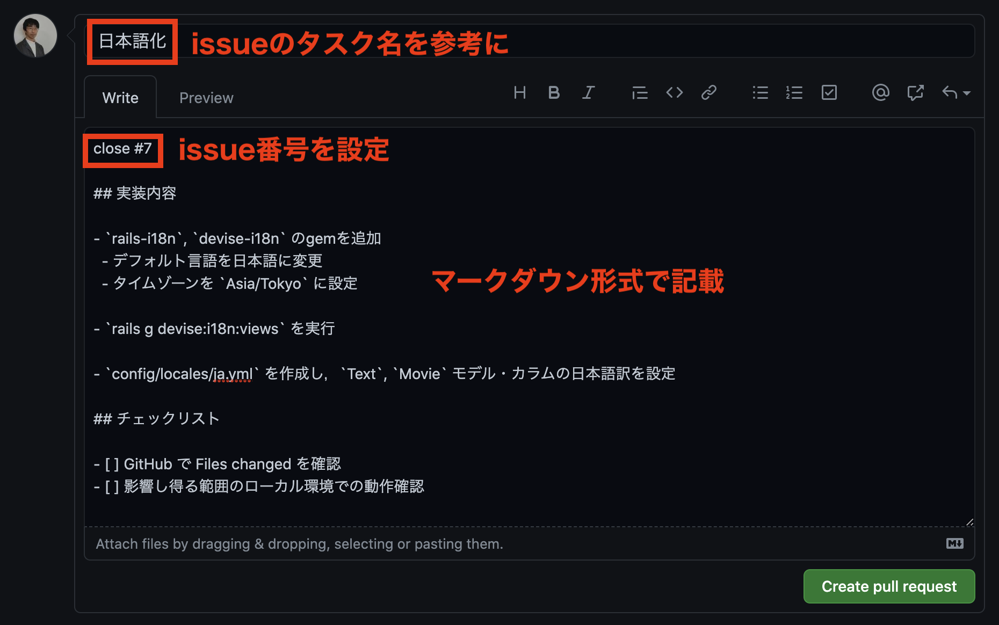

## （チーム開発）やんばるエキスパート教材 クローンアプリ開発

### クローン元の URL

https://sample-team-project-y.herokuapp.com/users/sign_in

元のアプリから細かい機能を削ったこちらのアプリを目標に開発を進めていただきます。

### 開発環境

- Ruby 2.7.3
- Rails 6.1.3.2
- PostgreSQL

### 開発環境構築(Ruby)

- Ruby 2.7.3 をインストールされていない場合は，以下を参考にして下さい。

https://www.yanbaru-code.com/questions/39

【補足】もしRubyのデフォルトバージョンを変更したくない方は，gemのインストール後に `rbenv global 指定したいバージョン` を実行して下さい。

### 開発環境構築(Railsアプリ)

```
git clone URL名
cd リポジトリ名
bundle install
yarn install --check-files
rails db:create db:migrate
```

### ブランチモデル

`Git-flow` に従うこととします。

ブランチ名 | 目的 | 備考
--- | --- | ---
main | リリース用 | masterではない！
develop | 開発用 | 機能実装用のブランチはここから切ること！
feature/*** | 機能実装用 | 派生元はdevelopブランチとすること！

- 新規タスクに取りかかる際は，必ず `develop` ブランチから切って下さい。`main` ブランチや `master` ブランチから切らないようにして下さい
- 機能実装用のブランチは， `feature/***` の形式（`feature/` を付ける）として下さい
- アプリ完成後に `develop` ブランチから `release` ブランチ（`release/1.0` など）を切って `main` ブランチにマージ

### チーム開発の進め方（開始時）

本来はメンバー内で協議し，DB設計，必要なタスクの洗い出し，タスクの切り分けを行うべきなのですが，チーム開発の進め方さえ十分に把握できていない最初の段階ではなかなか難しいと思います。

そこで `issue` に登録すべきタスクを `issues.md` にまとめております。こちらを参考に `issue` を設定し，実装を開始していただく形式といたします。

まず，「リーダー」を決めましょう。そして，「リーダー」を中心に，まずは以下の2つを決めましょう。

- 誰が，どの `issue` を，どの順番で設定するか
- 誰が，どの `issue` を担当するか。いつまでに終わらせるか。

チームメンバーが同じ日時に集まることが可能であれば，Zoom などで話し合うとよいでしょう。

`issue` の設定は，開発に入る前に，「番号順」に全て設定してしまうとよいでしょう。できればメンバー全員で分担して下さい。

`issue` の担当については，最初の時点で各自2個ずつ割り振り，ある程度進めてから再度割り振りを決めるとよいでしょう。各自の確保できる時間，タスクの依存関係などを考慮しつつ，リーダーを中心に割り振りを決めて下さい。

【注意】他のメンバーのタスクも必ず確認するようにして下さい。自分の担当したタスクで他のメンバーにも知らせるべきことがあれば，積極的に連絡するようにしましょう。

### タスク管理

タスクは `GitHub` の `issue` で行うこととします。

1. Projects を作成

`Projects` を作成することで，`issue（タスク）`を「カンバン」方式で管理できるようになります。

「リーダー」が代表して `Projects` を作成して下さい。

- GitHubリポジトリの `Projects` タブをクリック
- 「Create a project」ボタンをクリック
- 「Project board name」は「Description」は自由に設定。「Project template」は `Automated kanban` に設定し，「Create project」ボタンをクリック
- 「To do」に入っているデフォルトタスクは不要なので，全てアーカイブする
    - 「To do」の左側の「…」をクリックし，「Archive all cards」をクリックし，「Archive all cards」ボタンをクリック


2. issues を設定

`issues.md` を参考に `issue` を設定して下さい。メンバー4名で分担して設定することをお勧めします。

ただ，登録順に `issue番号` が振られますので，次のように順序よく設定された方が分かりやすいでしょう。

A さんが 1 ~ 6 を登録 --> B さんが 6 ~ 12 を登録 --> C さんが 13 ~ 18 を登録 --> D さんが 19 ~ 24 を登録

- GitHubリポジトリの `Issues` タブをクリック
- 「New issue」ボタンをクリック
- 「Title」と「Comment」を記載
- 右側の「Labels」は原則 `enhancement`，「Projects」 は 上記 で作成したものを選択
  - [GitHub: Managing labels](https://docs.github.com/ja/github/managing-your-work-on-github/managing-labels)
- 「Submit new issue」ボタンをクリック


3. Milestone を設定

`Milestones` で「期限」を設定し，`issue` を登録することで，タスクの進み具合を管理することができます。

- GitHubリポジトリの `Issues` タブをクリック
- 「Milestones」タブをクリック
- 「New milestone」ボタンをクリック
- 「Title」「Due date」「Description」を適切に設定し，「Create milestone」ボタンをクリック
  - 「Title」は「年月日」でよいでしょう
- 「Create milestone」ボタンをクリック

【注意】 `issue` ごとに期限は設定できません。先に `milestone` を設定し，それを `issue` に当てはめる流れとなります。1〜2週間おきで `milestone` を用意し，各自選択する方式でよいでしょう。


4. Assignees と Milestone を設定

タスクの担当者が決まった時点で，各担当者が，担当する issue に `Assignees` と `Milestone` を設定しましょう。

- GitHubリポジトリの `Issues` タブをクリック
- 設定したい `issue` をクリック
- `Assignees` と `Milestone` を設定


### RuboCop

このアプリには `RuboCop` を導入済みです。初耳の方は，以下の教材を確認して下さい。

https://www.yanbaru-code.com/texts/339

Git で add する前に，必ず `rubocop -a` を実行するようにして下さい。

`pre-commit` も導入済みです。メンバー内で協議し， `pre-commit` の設定や `VSCode` の設定を行ってもよいでしょう。

### チーム開発の進め方（issue設定後）

初期の issue 設定が完了しましたら，各自以下のサイクルで進めて下さい。

1. GitHubの `Projects` タブから「カンバン」に移動し，「To do」に入っている issue の中から1つを選択

- タスク1から順番に実装する必要はありません。各自担当している issue をどんどん進めていきましょう

2. 選択した issue の「Assignees」で自分を選択

- この作業により，誰が issue を担当しているかが分かるようになります

3. 選択した issue を「In progress」に移動

- この作業により，複数人が同じタスクを実行することを避けることができます

4. develop ブランチからブランチを切る

- ブランチ名は，「issueのタスク名」を2〜4単語の英語で表したものとすること

- 前回の作業ブランチからそのまま新しいブランチを切らないようにして下さい

```
git switch -c feature/ブランチ名
```

（`git switch -c feature/ブランチ名` と `git checkout -b ブランチ名` は同じコマンドです）

5. 実装中は add, commit をこまめに行う

- 【参考記事】https://qiita.com/jnchito/items/40e0c7d32fde352607be
- コミットメッセージは，変更内容を誰が見ても分かるように簡潔に書くこと
- add する前に `rubocop -a` も実行しておくこと

6. 動作確認を行った上で，GitHubにプッシュ

```
git push origin HEAD
```

- `rubocop -a` の実行忘れがないか確認して下さい。忘れていた場合は実行し，add, commit, push を行いましょう。

7. GitHubでプルリクを出す

- プルリクの「タイトル」は「issueのタスク名」に合わせるとよいでしょう
- プルリクの「メッセージ」は，テンプレートを元に，不要なものは削って使用して下さい
    - `close #2` のように 対応する「issue番号」を必ず入れて下さい。これが抜けると，「カンバン」の issue が自動的に移動しません
    - 「タスクの番号」と「issue番号」と「プルリク番号」はそれぞれ別物です。
- チェックボックスは，プルリクを出した後にクリックしてチェックを入れて下さい




8. Slackのチーム開発チャンネルにレビュー依頼を行う

- 必ず「プルリクのURL」を添えて下さい。「Conversation」タブのリンクでお願いします
- メンションも付けるようにして下さい

9. レビュー後に修正がある場合は，必要となる `手順5〜6` の作業を行い，動作確認を行い，必要があればプルリクの内容を修正した上で，再度レビュー依頼を行ってください

- プルリクを再度出す必要はありません。プッシュした際に反映されます

10. `Approve` されたら（レビューで「LGTM」を受けたら）GitHubで「マージ」を行う

- マージ前にコンフリクトが起きた場合は解消してからマージしてください。対処に不安がある場合は再度レビュー依頼を出して下さい

11. ローカルで develop ブランチに戻り，プルしてbundle installなどを行った上で `手順1` に戻る

```
# git status で差分がないことを確認後
git switch develop
git pull origin HEAD
bundle install
yarn install --check-files
rails db:migrate
```

### コンフリクト解消時の注意

コンフリクトの解消はGitHub上で行わないようにして下さい。

ローカルで解消し，動作確認をしてからレビュー依頼を出して下さい。

現在の開発ブランチをマージする手順は以下の通りです。

```
# git branch で作業ブランチにいることを確認後
git fetch --prune
git merge origin/develop
```

コンフリクトが起きているファイルは `git status` で確認できます。

`======` の「下側」が現在の開発状況，「上側」が自分の変更内容です。

「下側」をベースに，「上側」の自分の変更を加えるのが原則です。（単純に「両方残せばよい」「片方を削ればよい」という話ではありません）

`<<<<<<<`, `=======`, `>>>>>>>` が残った状態でレビュー依頼を出さないで下さい。

### 質問について

チーム開発に関する質問は，「質問」チャンネルではなく，「チーム開発」チャンネルにお願いします。

質問する際は，add, commit, pushを行い，プルリクを出し，そのリンクを必ず添えて下さい。

### レビューについて

メンターが必ずレビューを行いますが，各自，他のチームメンバーのプルリクも確認するようにして下さい。

そして，`LGTM(Looks Good To Me)` だと判断した場合は `Approve` コメントを付けてみましょう。

（「Files Changed」タブの右上にある「Review changes」をクリックし，「LGTMです」などのコメントを入れて「Approve」をチェックし「Submit review」ボタンをクリック）

実際の開発では，一人にレビューを押し付けることはありません。チームメンバーで協力してレビューを行うものです。

プルリクをローカルで動作確認されたい場合は次の手順となります。

```
# git status で差分がないことを確認
git switch develop
# プルリク番号とブランチ名を確認
# （画像の場合はタイトルの右隣の #53 の「53」が プルリク番号）
git fetch origin pull/プルリク番号/head:ブランチ名
# 例: git fetch origin pull/53/head:feature/line-page
git switch ブランチ名
```


【参考】 [GitHub: プルリクエストをローカルでチェック アウトする](https://docs.github.com/ja/github/collaborating-with-issues-and-pull-requests/checking-out-pull-requests-locally)

### 初期データ投入方法

原則として，以下のコマンドで初期データが全て入るように調整すること。

```
rails db:seed
```
