`GitHub` の `issue` に追加するタスク一覧です。各自，issueの内容は一通り確認して下さい。

【注意】 以下の連番はあくまで仮のものです。「issue 番号」は GitHub で割り振られたものを使用しましょう。

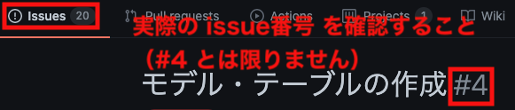

# 1. 開発環境の整備

## 実装内容

- 「開発環境・テスト環境のみ」にデバッグ用の gem を追加して，`bundle install` を実行

```rb
group :development, :test do
  gem 'byebug', platforms: [:mri, :mingw, :x64_mingw]
  # 次の3つを追加
  gem 'pry-byebug'
  gem 'pry-rails'
  gem 'pry-doc'
end
```

## 補足

以下は事前に導入済みです。

- `rails g controller` コマンドで生成されるファイルの設定
  - `config/initializers/generators.rb`
- プルリクのテンプレートの設定
  - `.github/pull_request_template.md`
- RuboCop の導入
  - `.rubocop.yml`

# 2. テキスト教材・動画教材ページの追加

## 実装内容

- `texts` コントローラと `movies` コントローラを作成
  - 作成されたビューファイルの中身は空にすること

```bash
rails g controller texts index show
rails g controller movies index
```

- ルーティングを `resources` で設定
  - `only` を使用して，使用するアクションを制限すること
  - `texts` コントローラは `index, show` のみ, `movies` コントローラは `index` のみ
  - `texts` コントローラの `index` アクションに対応するビューを `トップページ` に設定

## 参考文献

- [【Railsガイド】Rails のルーティング](https://railsguides.jp/routing.html#root%E3%82%92%E4%BD%BF%E3%81%86)

## 動作確認

- Rails サーバーを起動し，以下の URL にアクセスした際に空ページが表示される

http://localhost:3000
http://localhost:3000/texts/1
http://localhost:3000/movies

# 3. ページ全体の設定を追加

## 実装内容

ページ全体に共通する内容が書かれているファイル `app/views/layouts/application.html.erb` の

```erb
    <%= yield %>
```

を

```erb
    <header>
    </header>
    <main>
      <%# max_width メソッドは application_helper.rb に記載 %>
      <div class="base-container <%= max_width %>">
        <%= yield %>
      </div>
    </main>
    <footer>
    </footer>
```

としておき，全ページに共通して必要なCSSを `app/assets/stylesheets/application.css` に設定して下さい。

```css
/*
 *= require_tree .
 *= require_self
 */

/* 全体 */ 

.base-container {
  margin: 0 auto;
  padding: 1rem;
}

/* max-width */ 

.mw-sm {
  max-width: 576px;
}

.mw-md {
  max-width: 768px;
}

.mw-lg {
  max-width: 992px;
}

.mw-xl {
  max-width: 1200px;
}
```

さらに，全体の横幅を設定する `max_width` メソッドを `app/helpers/application_helper.rb` に定義しましょう。

（`devise_controller?` の箇所は `Devise` 導入時に有効化します）

```rb
module ApplicationHelper
  def max_width
    if controller_name == "texts" && action_name == "show"
      "mw-md"
    # Devise 導入後にコメントアウトを解除
    # elsif devise_controller?
    #  "mw-sm"
    else
      "mw-xl"
    end
  end
end
```

# 4. モデル・テーブルの作成

## 実装内容

次のモデル・テーブルを作成して下さい

- Textモデルとtextsテーブルを作成
  - カラムは「`genre`（`integer型`）」「`title`（`string型`）」「`content`（`text型`）」
  - 全て `NOT NULL` 制約を入れること
  - `genre` カラムのデフォルト値は `0` とすること

- Movieモデルとmoviesテーブルを作成
  - カラムは「`genre`（`integer型`）」「`title`（`string型`） 」と「`url`（`string型`）」
  - 全て `NOT NULL` 制約を入れること
  - `genre` カラムのデフォルト値は `0` とすること

`NOT NULL` 制約と `genre` カラムのデフォルト値を設定してから，マイグレーションを実行して下さい。

※モデルのバリデーションは別タスクとします

## 動作確認

ターミナルから以下を実行し，「`NOT NULL` 制約が入っていること」と「`genre` カラムのデフォルト値が `0` になっていること」を確認して下さい。

```bash
rails db

# PostgreSQL に接続後
\d texts
\d movies

# 確認後
exit
```

# 5. バリデーションを追加

【注意】「タスク4」はissue番号に置き換えて下さい


## 実装内容

「タスク4」完了後に行って下さい

- 「タスク4」で作成した2種類のモデルの各カラムに空データが入らないようにするバリデーションを追加
  - `with_options` を使用してみましょう

- `Text`, `Movie` モデルの `genre` カラムを「列挙型」にする

```rb
  enum genre: {
    invisible: 0, # 非表示
    basic: 1,
    git: 2,
    ruby: 3,
    rails: 4,
    php: 5
  }
```

## 参考文献

- [【やんばるエキスパート教材】列挙型（enum）とセレクトボックス](https://www.yanbaru-code.com/texts/351)

## 動作確認

ターミナルから以下のようなコマンドを実行し，「空データが入らないこと」「列挙型の設定ができていること」を確認して下さい。

```bash
# sandbox モードで Rails コンソールを起動
rails c -s

# Railsコンソール起動後

Text.create!(title: "hoge", content: "")
#=> ActiveRecord::RecordInvalid: Validation failed: Content can't be blank

Movie.create!(title: "", url: "fuga")
#=> ActiveRecord::RecordInvalid: Validation failed: Title can't be blank

Text.genres
#=> {"invisible"=>0, "basic"=>1, "git"=>2, "ruby"=>3, "rails"=>4, "php"=>5}

Movie.genres
#=> {"invisible"=>0, "basic"=>1, "git"=>2, "ruby"=>3, "rails"=>4, "php"=>5}
```

# 6. ログイン機能の実装

【注意】「タスク3」はissue番号に置き換えて下さい

## 実装内容

「タスク3」完了後に行って下さい

- `devise` を利用して，ユーザーのログイン機能を実装

- （マイグレーションの実行前に！）マイグレーションファイルのパスワード再設定関連のカラムをコメントアウト

```rb
# 次の箇所をコメントアウト

      ## Recoverable
      t.string   :reset_password_token
      t.datetime :reset_password_sent_at

# 次の箇所をコメントアウト

    add_index :users, :reset_password_token, unique: true
```

- パスワード再設定機能を削るため， `User` モデルの `:recoverable` を削除してマイグレーションを実行

- 「全て」のページを「ログイン必須」に変更

- 新規登録・ログイン・アカウント編集・ログアウトのリンクを，全てのページの一番上に追加
  -  `application.html.erb` の `header` タグ内にリンクを入れること
  - 直接 `application.html.erb` に書き込まず，部分テンプレート `app/views/layouts/_header.html.erb` を作成すること
  - 条件分岐を利用して表示内容を工夫とすること（ログインしているのにログインを表示してはならない）

- 以下の書式で `db/seeds.rb` にテスト用ユーザーを作成できるように設定
  - 何度実行してもエラーが出ないように `create!` ではなく `find_or_create_by!` を使用

```rb
email = 'test@example.com'
password = 'password'

# テストユーザーが存在しないときだけ作成
User.find_or_create_by!(email: email) do |user|
  user.password = password
  puts 'ユーザーの初期データインポートに成功しました。'
end
```

★日本語化，ナビバーの追加，ログイン画面の見た目を整える作業は別タスクにします。

## 参考文献

- [【公式】devise](https://github.com/heartcombo/devise)
- [【やんばるエキスパート教材】ログイン機能](https://www.yanbaru-code.com/texts/219)

## 動作確認

- `rails db:seed` を実行して初期データを作成
- Railsサーバーを起動し，トップページにアクセスした際に「ログイン画面」にリダイレクトされることを確認
- ログイン・ログアウトができるかどうかを確認
- リンクが適切に表示されていることを確認
- 「ログイン」ページに「Forgot your password?」のリンクが表示されていない
- パスワード再設定のページ（ http://localhost:3000/users/password/new ）にアクセスできないことを確認

# 7. 日本語化

【注意】「タスク6」はissue番号に置き換えて下さい

## 実装内容

「タスク6」完了後に行って下さい

- `rails-i18n`, `devise-i18n` のgemを追加し，必要な設定を行う
  - デフォルト言語を日本語に変更
  - タイムゾーンを `Asia/Tokyo` に設定

- `rails g devise:i18n:views` を実行

- `config/locales/ja.yml` を作成し，`Text`, `Movie` モデル・カラムの日本語訳を設定

## 参考文献

- [【公式】rails-i18n](https://github.com/svenfuchs/rails-i18n)
- [【公式】devise-i18n](https://github.com/tigrish/devise-i18n)
- [【やんばるエキスパート教材】ログイン機能](https://www.yanbaru-code.com/texts/219)
- [【Railsガイド】Rails 国際化 (i18n) API](https://railsguides.jp/i18n.html#active-record%E3%83%A2%E3%83%87%E3%83%AB%E3%81%A7%E7%BF%BB%E8%A8%B3%E3%82%92%E8%A1%8C%E3%81%AA%E3%81%86)

## 動作確認

- Railsサーバーを起動し，ログイン画面などが日本語化されていることを確認

- 以下のようなものを実行し，モデル名・カラム名が日本語化されていることを確認

```bash
# sandbox モードで Rails コンソールを起動
rails c -s

# Railsコンソール起動後
Text.model_name.human
#=> "テキスト教材"

Movie.model_name.human
#=> "動画教材"

Text.human_attribute_name(:genre)
#=> "ジャンル"

Text.create!
#=> ActiveRecord::RecordInvalid: バリデーションに失敗しました: タイトルを入力してください, 内容を入力してください

Movie.create!
#=> ActiveRecord::RecordInvalid: バリデーションに失敗しました: タイトルを入力してください, URLを入力してください
```

# 8. Bootstrapの導入

## 実装内容

- Bootstrap を導入
  - Bootstrap は `4.5.1` をインストールするように指定して下さい
  - Rails 5とは導入方法が異なりますので，注意して下さい
  - 混乱を避けるため css は Sprockets で扱うこと

★ Bootstrap でスタイルを付ける作業は別タスクとします

## 参考文献

- [【やんばるエキスパート教材】Bootstrap](https://www.yanbaru-code.com/texts/216)

## 動作確認

- Bootstrap が適用されていることを確認
  - `app/views/texts/index.html.erb` に動作確認用のボタンを1個配置し，表示されるか確認
  - 確認用に追加したボタンは削除しておくこと

# 9. 教材のCSVインポート機能を実装

【注意】「タスク5」はissue番号に置き換えて下さい

## 実装内容

「タスク5」完了後に行って下さい

- `db/seeds.rb` の最初に以下を追加

```
# texts, movies テーブルを再生成（関連付くテーブルを含む）
%w[texts movies].each do |table_name|
  ActiveRecord::Base.connection.execute("TRUNCATE TABLE #{table_name} RESTART IDENTITY CASCADE")
end
```

- `db/seeds.rb` に，テキスト教材のCSV（`db/csv_data/text_data.csv`）を読み込み texts テーブルにデータを投入する処理を追加

- `db/seeds.rb` に，動画教材のCSV（`db/csv_data/movie_data.csv`）を読み込み movies テーブルにデータを投入する処理を追加

## 参考文献

- [【やんばるエキスパート教材】CSVインポート](https://www.yanbaru-code.com/texts/217)

## 動作確認

- 以下を実行し，教材データが入っていることを確認

```bash
rails db:seed
rails c

# Railsコンソール起動後
Text.all
Movie.all
# CSVファイルのデータが入っていることを確認
```

# 10. 表示名の設定

【注意】「タスク5, 7」はissue番号に置き換えて下さい

## 実装内容

「タスク5, 7」完了後に行って下さい

- `enum-help` を追加
- `texts`, `movies` テーブルの `genre` に対応する表示名 `config/locales/enums.ja.yml` に追加
  - YAML の アンカー（`&`）, エイリアス（`*`）を利用して重複を回避すること
  - 「表示名」の設定は，「動作確認」の箇所を参考にして下さい

## 参考文献

- [【やんばるエキスパート教材】列挙型（enum）とセレクトボックス](https://www.yanbaru-code.com/texts/351)

## 動作確認

- 以下を実行し，教材データが入っていることを確認

```bash
rails c

# Railsコンソール起動後
Text.genres_i18n
#=> {"invisible"=>"非表示", "basic"=>"Basic", "git"=>"Git", "ruby"=>"Ruby", "rails"=>"Ruby on Rails", "php"=>"PHP"}

Movie.genres_i18n
#=> {"invisible"=>"非表示", "basic"=>"Basic", "git"=>"Git", "ruby"=>"Ruby", "rails"=>"Ruby on Rails", "php"=>"PHP"}
```

# 11. ナビバーの実装

【注意】「タスク6,8」はissue番号に置き換えて下さい

## 実装内容

「タスク6,8」完了後に行って下さい

- Bootstrap のナビバーを利用して，次の図のようなナビバーを作成
  - `app/views/layouts/_header.html.erb` を編集
  - `.fixed-top` を使用して上に固定すること
  - ロゴは `app/assets/images/yanbaru_expert_logo.png` を利用すること
  - リンクは `link_to` ヘルパーメソッドを使用すること
  - PHPテキスト教材のパスは `texts_path(genre: "php")`, 動画教材は `movies_path(genre: "php")` とすること
  - `md` サイズ未満で「ハンバーガーメニュー」に切り替わるようにすること

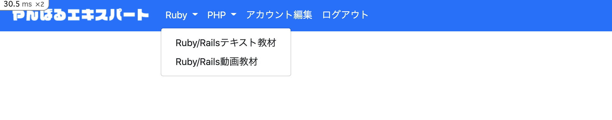
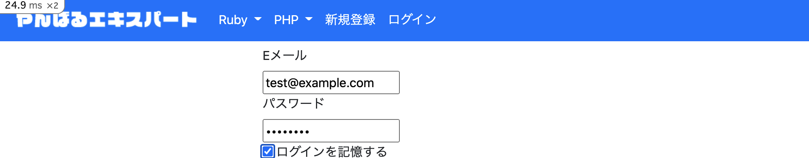

- コンテンツがヘッダーに隠れないように調整
  - デベロッパーツールでヘッダーの高さを調べ， `body` タグに `padding-top` を設定

## 参考文献

- [【公式】Bootstrap（Navbar）](https://getbootstrap.jp/docs/4.5/components/navbar/)
- [【やんばるエキスパート教材】メッセージ投稿アプリ（その3・Bootstrap）](https://www.yanbaru-code.com/texts/271)
- [【やんばるエキスパート教材】画像ファイルが表示されない](https://www.yanbaru-code.com/questions/59)

## 動作確認

- ログイン時・ログアウト時の表示が上記画像と同じような形式になっているかを確認
- ヘッダーが上に固定されていることを確認（ブラウザの縦幅を短めにしてスクロール）
- `768px` 未満で「ハンバーガーメニュー」に変化すること
- 「ドロップダウン」「ハンバーガーメニュー」が問題なく動作すること
- リンクが正常に機能していること

リンク                | URL
-------------------|---------------------------------------
ナビバーのロゴ            | http://localhost:3000
Ruby/Railsテキスト教材 | http://localhost:3000/texts
Ruby/Rails動画教材 | http://localhost:3000/movies
PHPテキスト教材        | http://localhost:3000/texts?genre=php
PHP動画教材        | http://localhost:3000/movies?genre=php

# 12. フラッシュの実装

【注意】「タスク8」はissue番号に置き換えて下さい

## 実装内容

「タスク8」完了後に行って下さい

- フラッシュの表示機能
  - ナビバー同様，横幅一杯とすること（mainタグの開始タグすぐ下）
  - 直接`application.html.erb`に書き込まず，部分テンプレート `app/views/layouts/_flash.html.erb` を作成して読み込むようにすること

- フラッシュの背景色を設定
  - Bootstrapに用意されているものを利用すること
  - `notice` は `alert-info` か `alert-success`, `alert` は `alert-danger` とすること

## 参考文献

- [【公式】Bootstrap（Alerts）](https://getbootstrap.jp/docs/4.5/components/alerts/)
- [【やんばるエキスパート教材】メッセージ投稿アプリ その3）](https://www.yanbaru-code.com/texts/271)

## 動作確認

- ログイン時・ログアウト時にフラッシュが表示されることを確認

# 13. Railsテキスト教材一覧ページの実装

【注意】「タスク8,9,10」はissue番号に置き換えて記載すること

## 実装内容

「タスク8,9,10」完了後に行って下さい

- `app/models/text.rb` に次を定義

```rb
  RAILS_GENRE_LIST = %w[basic git ruby rails]
```

- Railsテキスト教材の一覧ページを作成
  - 表示するジャンルは `Text::RAILS_GENRE_LIST` に制限
  - Bootstrapの `Cards` や `Grid System` を用いて下図のようなスタイルにすること
  - `each` を使わず「[コレクションをレンダリング](https://railsguides.jp/layouts_and_rendering.html#%E3%82%B3%E3%83%AC%E3%82%AF%E3%82%B7%E3%83%A7%E3%83%B3%E3%82%92%E3%83%AC%E3%83%B3%E3%83%80%E3%83%AA%E3%83%B3%E3%82%B0%E3%81%99%E3%82%8B)」を利用しましょう
  - 画像部分は [デフォルト画像](https://d5izmuz0mcjzz.cloudfront.net/texts/no_image.jpg) を表示するのみとする
  - カードの `height`, `max-width` を指定すること
  - テキスト教材ページでしか利用しないスタイルは `app/assets/stylesheets/texts.scss` を作成して書き込むこと
  - 検索機能は実装しない
  - 広告は実装しない
  - カード全体を「詳細ページ」へのリンクにする作業は別タスクとする
  - 「読破済みボタン」はボタンの配置のみとする。（機能は別タスクで実装）

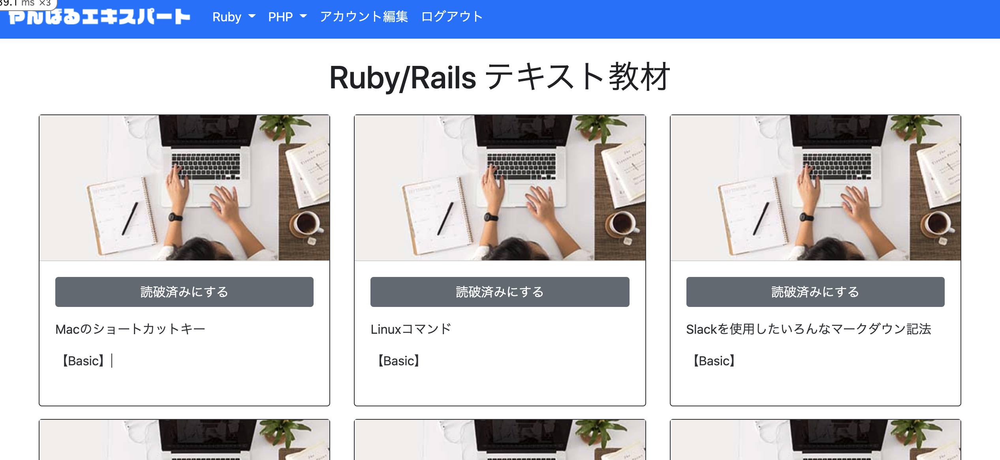
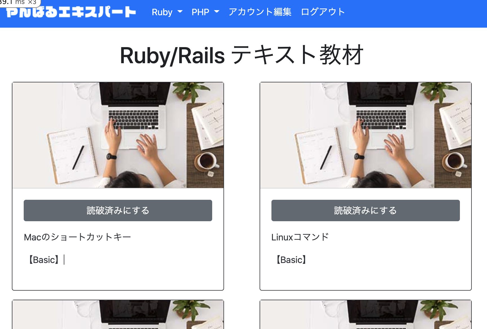
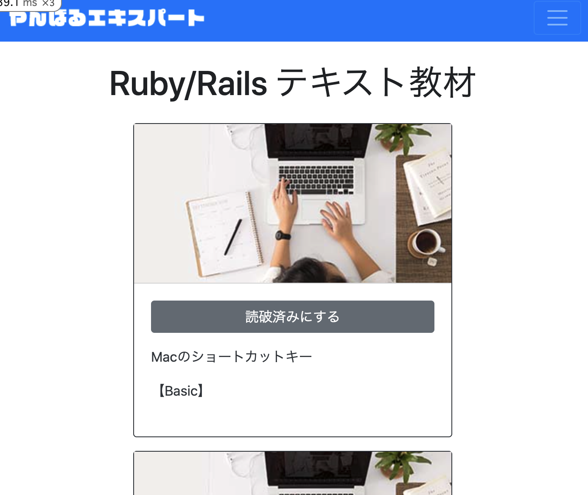

## 参考文献

- [【公式】Bootstrap Cards](https://getbootstrap.jp/docs/4.5/components/card/)
- [【公式】Bootstrap Grid system](https://getbootstrap.jp/docs/4.5/layout/grid/)

## 動作確認

- 画像のようにレスポンシブ対応ができているかどうかを確認
- ブラウザの横幅次第でカードの横幅が長くなりすぎていないか確認
- PHPのテキスト教材が表示されていないことを確認

# 14. devise関連ページのスタイルを修正

【注意】「タスク11」はissue番号に置き換えて記載すること

## 実装内容

- `devise-bootstrap-views` を インストール

- Bootstrap のビューファイルを作成

```bash
rails g devise:views:bootstrap_templates -f
```

この時点でコミットしておくこと!

- `app/helpers/application_helper.rb` の次の2行のコメントアウトを解除

```rb
    # elsif devise_controller?
    #  "mw-sm"
```

- 「新規登録」「ログイン」「アカウント編集」のページを修正

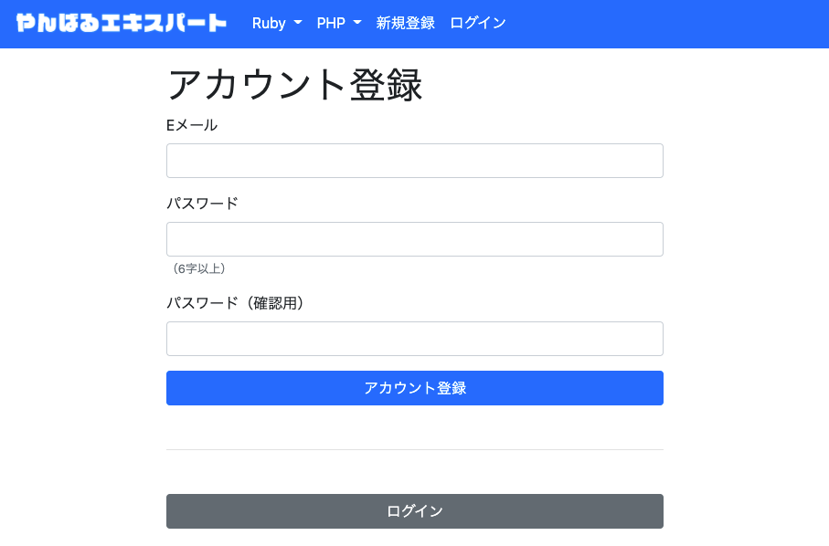
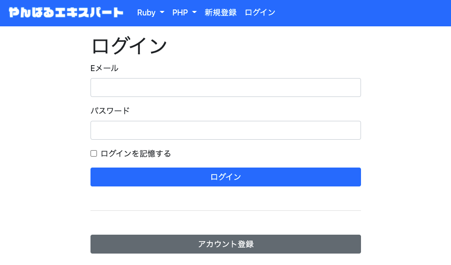
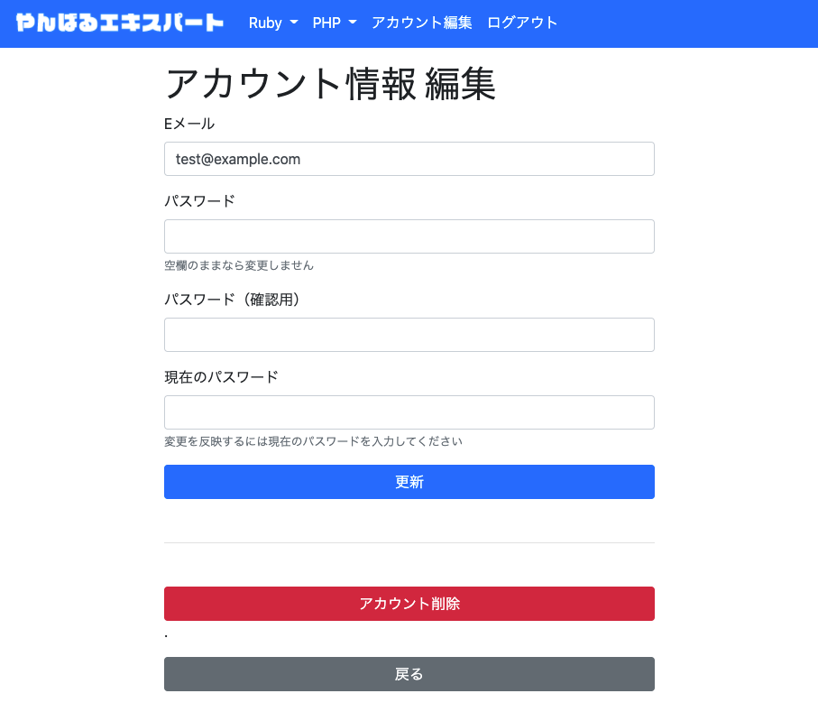

## 参考文献

- [【公式】devise-bootstrap-views](https://github.com/hisea/devise-bootstrap-views)

## 動作確認

- 「アカウント編集」「ログイン」「アカウント登録」ページが全て Bootstrap のスタイルが適用されていることを確認

# 15. Rails動画教材ページの実装

【注意】「タスク8,9,10」はissue番号に置き換えて記載すること

## 実装内容

「タスク8,9,10」完了後に行って下さい

- `app/models/movie.rb` に次を定義

```rb
  RAILS_GENRE_LIST = %w[basic git ruby rails]
```

- Rails動画教材の一覧ページを作成
  - 表示するジャンルは `Movie::RAILS_GENRE_LIST` に制限
  - Bootstrapの `Cards` や `Grid System` を用いて下図のようなスタイルにすること
  - `each` を使わず「[コレクションをレンダリング](https://railsguides.jp/layouts_and_rendering.html#%E3%82%B3%E3%83%AC%E3%82%AF%E3%82%B7%E3%83%A7%E3%83%B3%E3%82%92%E3%83%AC%E3%83%B3%E3%83%80%E3%83%AA%E3%83%B3%E3%82%B0%E3%81%99%E3%82%8B)」を利用しましょう
  - 各動画にレベル表示を入れること（`rails collection index` などで検索）
  - カードの下側部分に `height` を指定して揃えること
  - 動画教材ページでしか利用しないスタイルは `app/assets/stylesheets/movies.scss` を作成して書き込むこと
  - 広告は実装しない
  - ページネーションは別タスクとする
  - 「視聴済みボタン」はボタンの配置のみとする。（機能は別タスクで実装）

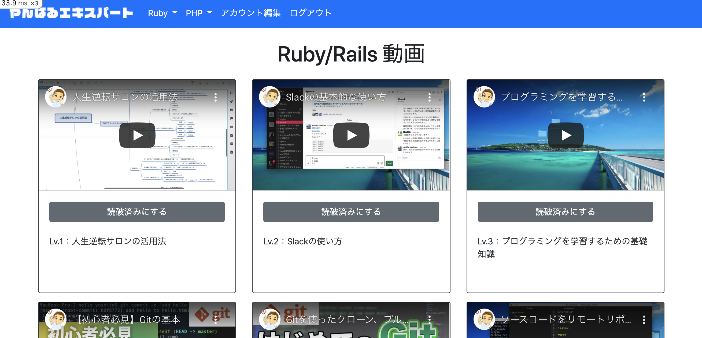
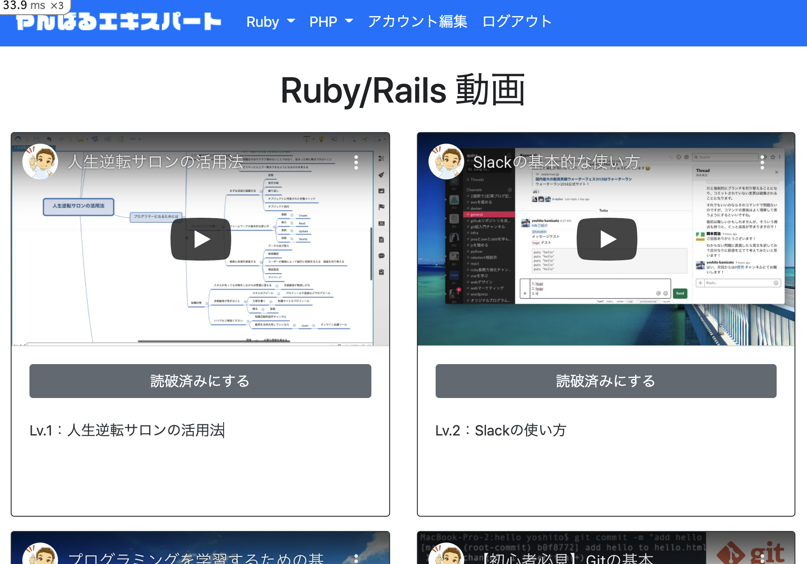
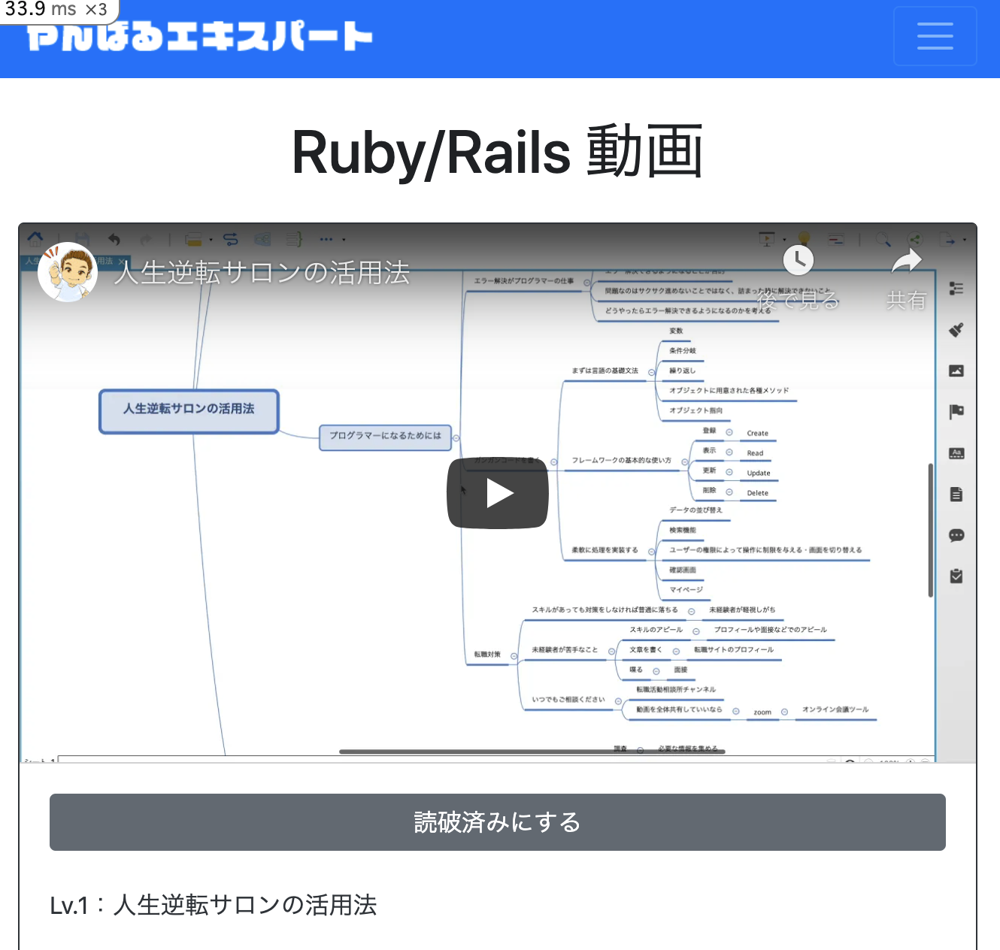

## 参考文献

- [【公式】Bootstrap Cards](https://getbootstrap.jp/docs/4.5/components/card/)
- [【公式】Bootstrap Grid system](https://getbootstrap.jp/docs/4.5/layout/grid/)
- [【公式】Embeds](https://getbootstrap.com/docs/4.5/utilities/embed/)
- [【やんばるエキスパート教材】YouTube動画の投稿](https://www.yanbaru-code.com/texts/349)

## 動作確認

- 画像のようにレスポンシブ対応ができているかどうかを確認
- カードの高さが一定になっているか確認
- PHPの動画教材が表示されていないことを確認

# 16. 管理画面の実装

【注意】「タスク7,10」はissue番号に置き換えて記載すること

## 目的

テキスト教材・動画教材を「管理画面」から追加できるようにするため

（初期データをCSV経由で投入しましたが，元アプリでは教材ができる度に「管理画面」から投入しています）

## 実装内容

「タスク7,10」完了後に行って下さい

- `activeadmin` の `Gem` を追加し，設定ファイルをインストール
  - `devise`, `rails-i18n`, `devise-i18n` は追加済みです

- `User`, `Text`, `Movie` の管理画面を追加するコマンドを実行

この時点でコミットしておくこと！

- `db/seeds.rb` に追加された `AdminUser.create!` の1行を `User` と同様の形式に修正（何度実行してもエラーが出ないようにする）
  - `admin_email = "admin@example.com"` を先に定義して利用すること
  - 開発環境に限定する条件は不要です

- 管理画面の各ページのカラム・フォームを修正
  - ジャンルは `config/locales/enums.ja.yml` にある「表示名」を利用できるようにすること
  - `app/admin/users.rb` については， `app/admin/admin_users.rb` を参考に変更すること
  - 存在しないカラム `current_sign_in_at`, `sign_in_count` を表示しないように削ること

- 管理画面以外のスタイルに影響が出ないように対処

- 通常ログインしなくても管理者ログインできるように設定

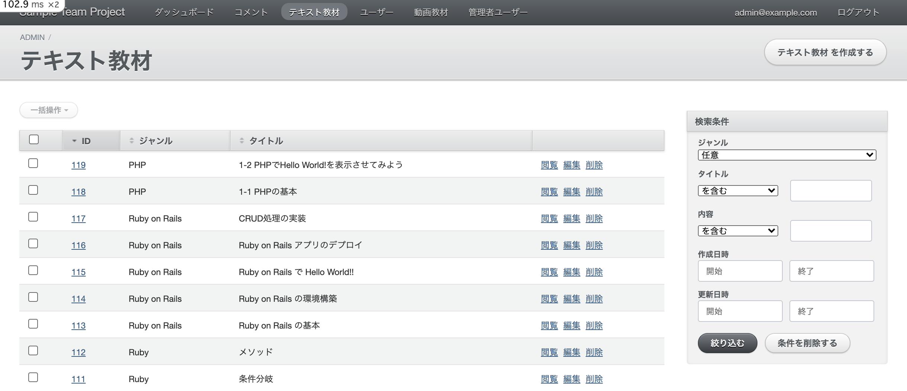
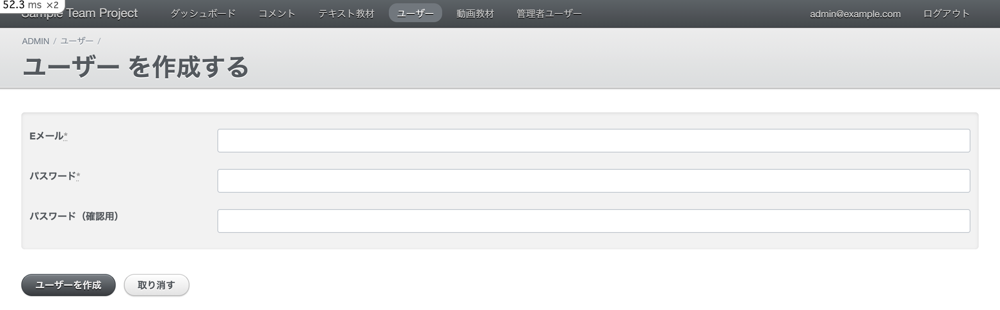

## 参考文献

- [【公式】Active Admin](https://github.com/activeadmin/activeadmin)
- [【やんばるエキスパート教材】管理者画面](https://www.yanbaru-code.com/texts/220)
- [【やんばるエキスパート教材】列挙型（enum）とセレクトボックス](https://www.yanbaru-code.com/texts/351)

## 動作確認

- ナビバーに「ダッシュボード」「コメント」「テキスト教材」「ユーザー」「動画教材」「管理者ユーザー」のタブ
- 各ページのカラム，検索，フォームが日本語化できていること
- テキスト教材・動画教材の投稿ができること
  - ジャンルは「表示名」から選択できる（「rails」ではなく「Ruby on Rails」）
- ユーザーの新規登録ができること
- テキスト教材・動画教材は「ジャンル」の検索ができること
- 管理画面以外のスタイルに影響が出ていないこと

# 17. Railsテキスト教材詳細ページの実装

【注意】「タスク13」はissue番号に置き換えて記載すること

## 実装内容

「タスク13」完了後に行って下さい

- aタグの下線が入らないように `app/assets/stylesheets/application.scss` に次を追加

```css
/* 全体 */

a:hover {
  text-decoration: none;
}
```

- 一覧ページから詳細ページに移動できるようにする
  - `link_to` のブロックを利用するのがポイント

- マークダウン形式を変換する `redcarpet`, シンタックスハイライトを適用する `rouge` をインストール
  - `coderay` は使用していません

```rb
gem "redcarpet"
gem "rouge"
```

- `app/helpers/markdown_helper.rb` を作成し，次を設定

```rb
module MarkdownHelper
  def markdown(text)
    renderer = Redcarpet::Render::HTML.new(render_options)
    Redcarpet::Markdown.new(renderer, extensions).render(text).html_safe
  end

  private

  def render_options
    {
      filter_html: false, # htmlを無効化
      hard_wrap: true, # 改行を br 要素に変換
      link_attributes: { target: "_blank", rel: "noopener" } # リンクの設定
    }
  end

  def extensions
    {
      autolink: true, # http https ftpで始まる文字列を自動リンク
      fenced_code_blocks: true, # コードブロックを解析
      no_intra_emphasis: true, # 単語内の強調を解析しない
      tables: true, # 	テーブルを解析
      space_after_headers: true, # ヘッダーの先頭のハッシュとハッシュ名の間にスペースを要求
      hard_wrap: true, # 改行を br 要素に変換
      xhtml: true, # xhtml のタグを出力する(Render::XHTMLでは常に有効)
      lax_html_blocks: true # 複数行のコードの前後に空行が不要
      # strikethrough: true, # 取り消し線(~)を解析する
    }
  end
end
```

【重要】 ここで定義した `markdown` メソッドを使うことで，マークダウン形式の文字列を HTML に変換できます

- `app/assets/stylesheets/rouge.scss.erb` を作成し，`Rouge` のシンタックスハイライト用のスタイルを追加

```erb
<%= Rouge::Themes::Github.render(scope: '.highlight') %>
```

- `app/assets/stylesheets/markdown.scss` を作成し，マークダウン専用のスタイルを追加

```scss
@import "bootstrap/scss/bootstrap";

.markdown {
  table {
    @extend .table;
    display: block;
    overflow-x: scroll;
    white-space: nowrap;
    -webkit-overflow-scrolling: touch;
    border: initial;

    thead {
      background-color: #EEFFFF;
    }
  }

  h1 {
    font-size: 1.75rem;
    text-align: left;
  }

  pre {
    overflow: auto;
    word-wrap: normal;
    white-space: pre;
    background-color: #f6ffff;
    padding: 0.5rem;
    margin: 1rem 0;
    border: 2px dashed #d6dddd;

    code {
      table.rouge-table {
        margin: 0;

        td.rouge-code {
          padding: 0;
          vertical-align: top;

          pre {
            padding: 5px 10px;
          }
        }
      }
    }
  }
}
```

【重要】 `markdown` クラスを付けたタグで囲むことで，マークダウン用のスタイルが適用されます。例として，次をビューファイルに追加して動作確認をしてみましょう。

```erb
<% 
  str = <<~TEXT
  | HTTPメソッド | URL             | アクション   | 役割             |
  |----------|-----------------|---------|----------------|
  | GET      | /users          | index   | 一覧表示         |
  | GET      | /users/new      | new     | 新規投稿フォーム表示 |
  | POST     | /users          | create  | 新規投稿処理     |
  | GET      | /users/:id      | show    | 詳細表示         |
  | GET      | /users/:id/edit | edit    | 更新フォーム表示     |
  | PATCH    | /users/:id      | update  | 更新処理         |
  | DELETE   | /users/:id      | destroy | 削除処理         |
TEXT
%>
<div class="markdown">
  <%= markdown(str) %>
</div>
```

- 以上を利用して，詳細ページを実装
  - 「タイトル(title)」と「内容(content)」を表示
  - 「内容」はマークダウンを変換した表示ができるようにすること
  - 詳細ページには「読破済み」機能は実装しないこととする

## 参考文献

- [【公式】Redcarpet](https://github.com/vmg/redcarpet)
- [【公式】Rouge](https://github.com/rouge-ruby/rouge)

## 動作確認

- 一覧ページのカードから対応する詳細ページに遷移できる
- 詳細ページで，下図のようにマークダウンを反映したスタイルとなっている

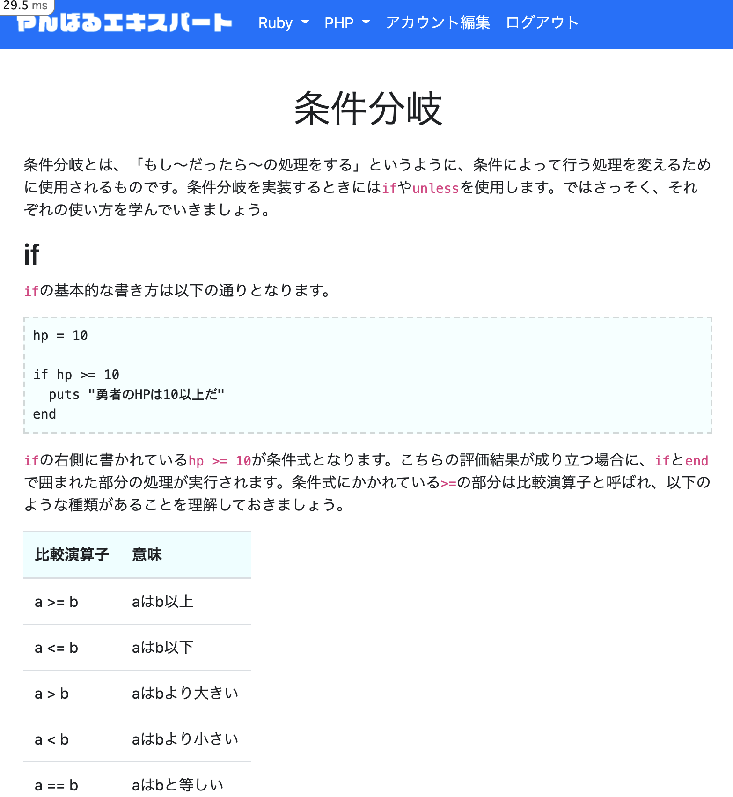


# 18. 動画教材ページのジャンル分け

【注意】「タスク15」はissue番号に置き換えて下さい

## 実装内容

「タスク15」完了後に行って下さい

- PHP動画教材ページで「PHPの動画教材のみ」が表示されるように修正
  - `PHP動画教材` のリンクをクリックした際のクエリパラメータ `?genre=php` を利用
  - モデルにクラスメソッドを作成して対応できるとなおよいでしょう

- 「Ruby/Rails動画教材ページ」のタイトルは「Ruby/Rails 動画」，「PHP動画教材ページ」のタイトルは「PHP 動画」とする
  - `app/helpers/application_helper.rb` にメソッドを作成して対応できるとなおよいでしょう

## 動作確認

- 「Ruby/Rails動画教材」に「PHP動画」が含まれていないことを確認
- 「PHP動画教材」に「PHP動画」のみが表示されていることを確認
- クエリパラメータ `?genre=php` を `php` 以外に変更してアクセスした際は「Ruby/Rails動画教材」が表示されることを確認


# 19. ゲストログイン機能を実装

【注意】「タスク14」はissue番号に置き換えて下さい

## 実装内容

「タスク14」完了後に行って下さい

- ゲストログイン機能を実装
  - 「ナビバー」と「ログイン・新規登録のページ(`app/views/devise/shared/_links.html.erb` を利用)」に配置
  - ゲストユーザーのメールアドレスは `test@example.com` とすること
  - ゲストユーザーを削除・更新されるケースへの対応は不要です
  - パスワード再設定機能は停止しているので対処不要です

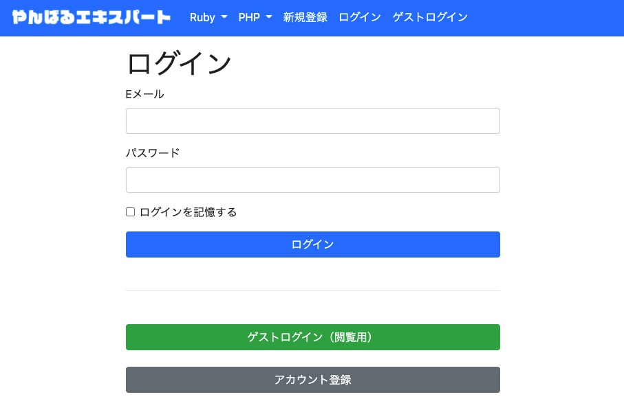
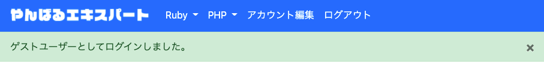

## 参考文献

- [【やんばるエキスパート教材】ゲストログイン機能の実装](https://www.yanbaru-code.com/texts/392)

## 動作確認

- ゲストログインのリンク・ボタンからログインできることを確認


# 20. テキスト教材ページのジャンル分け

【注意】「タスク13, 18」はissue番号に置き換えて下さい

## 実装内容

「タスク13, 18」完了後に行って下さい

- PHPテキスト教材ページで「PHPのテキスト教材のみ」が表示されるように修正
  - `PHPテキスト教材` のリンクをクリックした際のクエリパラメータ `?genre=php` を利用
  - モデルにクラスメソッドを作成して対応できるとなおよいでしょう

- 「Ruby/Railsテキスト教材ページ」のタイトルは「Ruby/Rails テキスト教材」，「PHPテキスト教材ページ」のタイトルは「PHP テキスト教材」とする
  - 「タスク18」の `app/helpers/application_helper.rb` にメソッドを利用して対応できるとなおよいでしょう

## 動作確認

- 「Ruby/Railsテキスト教材」に「PHPテキスト教材」が含まれていないことを確認
- 「PHPテキスト教材」に「PHPテキスト教材」のみが表示されていることを確認
- クエリパラメータ `?genre=php` を `php` 以外に変更してアクセスした際は「Ruby/Railsテキスト教材」が表示されることを確認


# 21. 動画教材のページネーションを実装

【注意】「タスク15」はissue番号に置き換えて下さい

## 実装内容

「タスク15」完了後に行って下さい

- Gem `kaminari` をインストール

- 動画教材ページにページネーションを実装
  - 1ページの表示数は `12` 件とすること

- 2ページ目以降のレベル表示を連番にする
  - `offset_value` を利用

- ページネーションに `Bootstrap` を適用

```bash
rails g kaminari:views bootstrap4
```

- ページネーションを中央寄せにする

## 参考文献

- [【やんばるエキスパート教材】検索機能(Ransack)](https://www.yanbaru-code.com/texts/221)

## 動作確認

- Ruby/Rails動画 に ページネーション が付いていることを確認

- 動画の1ページの最大表示数が 12 であることを確認

- 2ページ目のレベル開始が `13` であることを確認

- ページネーションに Bootstrap のスタイルが適用され，中央寄せになっていることを確認


# 22. テキスト教材の読破済み機能

【注意】「タスク13」はissue番号に置き換えて下さい

## 実装内容

「タスク13」完了後に行って下さい

- 読破済み機能に使用する `ReadProgress` モデルを作成
  - 外部キー設定を行い，ユニーク制約を入れてからマイグレーション
  - バリデーションをモデルに追加
  - 関連付けを入れる（`User` と `Text` の関連付けは使用しないので入れなくてもOK）
  - 初期データの実装は不要です

（この時点で下記の動作確認を行ってみましょう）

- テキスト教材一覧ページに読破済み機能を実装
  - 詳細ページには実装しなくてOK
  - 非同期で処理できるようにすること

## 参考文献

- [【やんばるエキスパート教材】モデルの関連付け その2（多対多）](https://www.yanbaru-code.com/texts/297)

## 動作確認

- 以下を確認

```zsh
rails c -s

# Railsコンソール起動後
user = User.first
text, text2 = Text.limit(2)
ReadProgress.delete_all

user.read_progresses.create!(text_id: text.id)
user.read_progresses.create!(text_id: text2.id)

ReadProgress.count
#=> 2

text.read_progresses.create!(user_id: user.id)
#=> ActiveRecord::RecordInvalid: バリデーションに失敗しました: Userは同じテキスト教材を2回以上読破済みにはできません

ReadProgress.create!
#=> ActiveRecord::RecordInvalid: バリデーションに失敗しました: ユーザーを入力してください, テキスト教材を入力してください
```

- テキスト教材一覧ページの読破済み機能が動作していることを確認

# 23. 動画教材の読破済み機能

【注意】「タスク15」はissue番号に置き換えて下さい

## 実装内容

「タスク15」完了後に行って下さい

- 視聴済み機能に使用する `WatchProgress` モデルを作成
  - 外部キー設定を行い，ユニーク制約を入れてからマイグレーション
  - バリデーションをモデルに追加
  - 関連付けを入れる（`User` と `Movie` の関連付けは使用しないので入れなくてもOK）
  - 初期データの実装は不要です

（この時点で下記の動作確認を行ってみましょう）

- 動画教材一覧ページに視聴済み機能を実装
  - 非同期で処理できるようにすること

## 参考文献

- [【やんばるエキスパート教材】モデルの関連付け その2（多対多）](https://www.yanbaru-code.com/texts/297)

## 動作確認

- 以下を確認

```zsh
rails c -s

# Railsコンソール起動後
user = User.first
movie, movie2 = Movie.limit(2)
WatchProgress.delete_all

user.watch_progresses.create!(movie_id: movie.id)
user.watch_progresses.create!(movie_id: movie2.id)

WatchProgress.count
#=> 2

movie.watch_progresses.create!(user_id: user.id)
#=> ActiveRecord::RecordInvalid: バリデーションに失敗しました: Userは同じ動画教材を2回以上視聴済みにはできません

WatchProgress.create!
#=> ActiveRecord::RecordInvalid: バリデーションに失敗しました: ユーザーを入力してください, 動画教材を入力してください
```

- 動画教材一覧ページの視聴済み機能が動作していることを確認


# 24. リリース作業

全タスク完了後に行うこと

## 実装内容

- ブランチ名は `release/1.0` とすること

- Herokuにプッシュした際に自動でマイグレーションを行う設定を追加

```zsh
echo "release: bin/rails db:migrate" > Procfile
```

- Heroku アプリを作成
  - ステージング環境は作成しなくてもOK
  - 自動デプロイ設定は，権限の都合上対応が難しいため，設定しない方向でお願いします

- コミットした上で Heroku にデプロイし，初期データを投入
  - エラーが出た場合は対応

```zdh
git push heroku HEAD:main
heroku run rails db:seed
```

- 動作確認を行い，異常を発見した場合は対応

- 問題が解消された時点でプルリクを2つ出す
  - マージ先の指定は `develop` ブランチと `main` ブランチとする

【補足】2つ目のプルリクエストを出す際は，「Pull requests」タブの「New pull request」ボタンを押し，`base` を `main`, `compare` を `release/1.0` に変更する

- なるべく残りのメンバー全員で動作確認を行い，問題なければ両方に `Approve` コメントを出す

- 動作確認が完了次第マージを行う

## 参考文献

- [【やんばるエキスパート教材】アプリのデプロイ（Heroku）](https://www.yanbaru-code.com/texts/210)

## 動作確認

本番環境で一通りの動作を確認すること。


【補足】全てのタスクが完了したら，他のメンバーも各自Herokuにデプロイしてもよいでしょう。